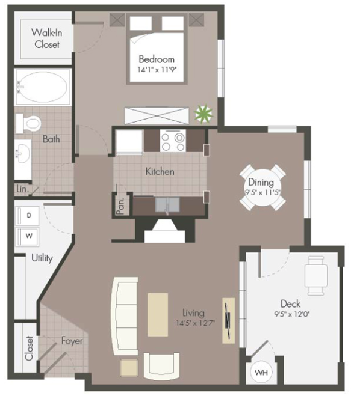
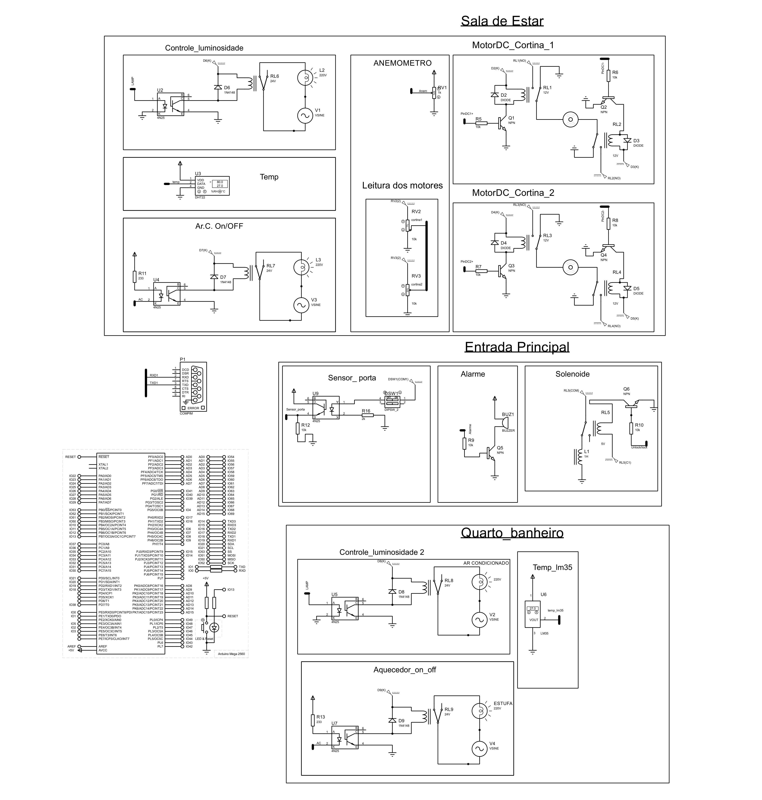
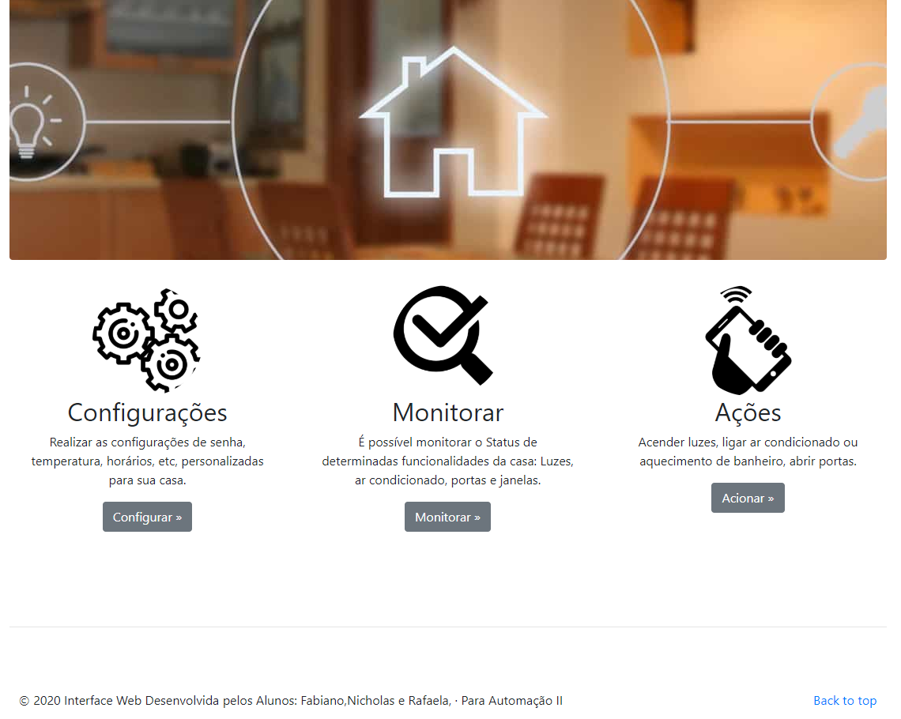
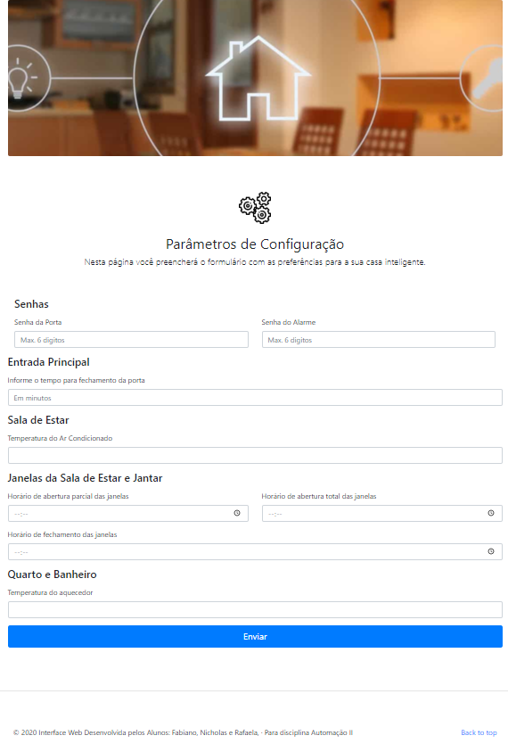
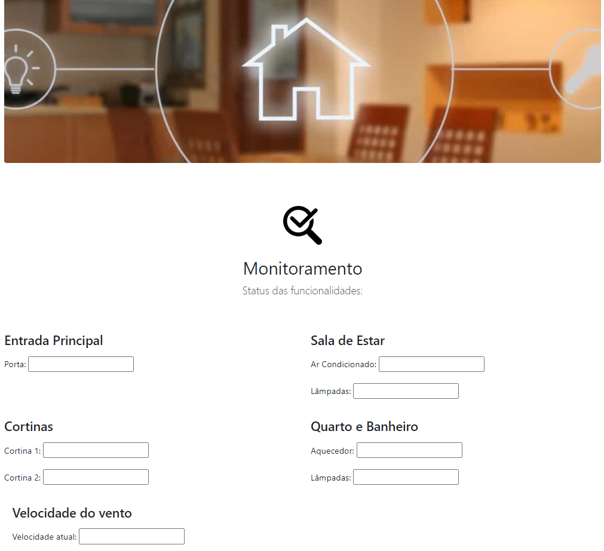
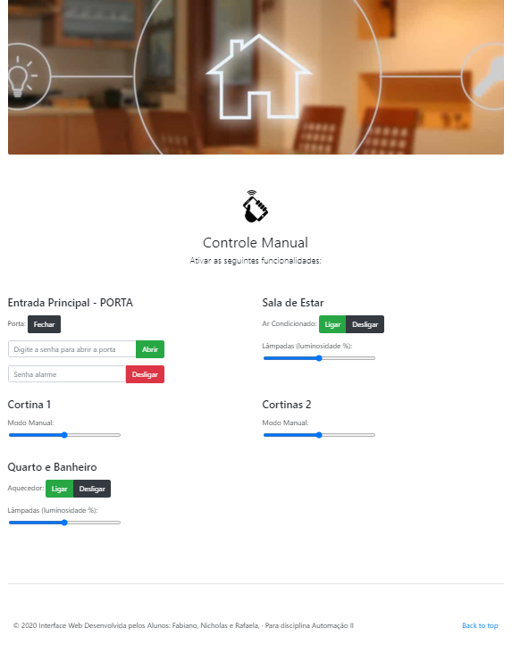

# Automação Residencial 
> O projeto consiste na automatização de um pequeno apartamento, 
utilizando tecnologias como NodeJS, HTML, C e um simulador para 
representar o funcionamento do harware.

O que é automação residencial?

Automação residencial pode ser resumida como a aplicação das tecnologias, dentro das nossas casas. 
Tem como objetivo facilitar tarefas que antes dependiam somente dos morados, como ligar lâmpadas, 
fechar portas, ligar sons e controlar temperaturas. Com sensores de presença, 
temporizadores ou até um simples toque em um botão do controle remoto, 
é possível acionar serviços, trazendo praticidade, segurança, economia e conforto.

O objetivo deste trabalho é projetar um sistema de controle para automatizar um apartamento. 
O sistema monitora algumas variáveis como temperatura, velocidade do vento, posição das cortinas, 
estado da porta de entrada, etc. 
Os estados atuais dessas variáveis podem ser visualizados através de uma interface WEB, sendo possível agir sobre elas.

**_PLANTA DO APARTAMENTO_**

## Especificações do Projeto 
_*Entrada Principal (Porta de entrada)_
* Como entrada principal, o sistema pode monitorar o estado atual da porta, destravar a porta remotamente, 
através de uma senha definida por uma das páginas da WEB, assim como, após destravada, a porta deve ser fechada 
em um tempo máximo, que também pode ser definido pelas páginas WEB. 
Caso isso não ocorra, um alarme sonoro é ativado na forma intermitente (2 min. ON e 5 min. OFF), 
até seu fechamento, ou desativação do alarme de forma manual (dado pela mesma senha do acesso).

_*Sala de Estar_
* A sala de estar conta com um sensor de temperatura, que é responsável por acionar o ar condicionado, 
com o objetivo de manter a temperatura no valor definido pelo usuário. Além disso o controle do ar e 
a luminosidade da sala também podem ser ativados remotamente de forma manual, por meio da interface WEB. 

_*Cortinas da sala de estar e de jantar_
* As posições das cortinas das janelas poderão ser controladas e monitorada remotamente pela interface WEB. 
As cortinas devem abrir automaticamente conforme horários programados na página WEB de configuração, e três horários poderão ser programados:

_* Horário 1 -> para abertura na metade do seu curso_

_* Horário 2 -> para abertura total_

_* Horário 3 -> para fechamento total_

Além do monitoramento das cortinas, o sistema também possui o monitoramento do vento externo, 
e tem como principal objetivo, no momento em que o vento externo ultrapassa a velocidade de 50km/h, 
as cortinas devem ser fechadas.
  
_*Quarto e Banheiro_
* O cômodo do quarto e banheiro possui a luminosidade controlada remotamente, 
 e, além disso, um sensor de temperatura. Quando a temperatura for inferior a 17°C, 
 o aquecedor presente no local deve ser ligado automaticamente.

_*Protocolo implementado_

  Formato do protocolo, onde cada colchete é um byte:
[:][envio/recepcao][local/cômodo][0][acao no comodo][dado][dado][dado][dado][lrc1][lrc2]

Exemplo: :0101FFFFAE
msg[0]=':' = inicio da mensagem
msg[1]='0' = envio do servidor para o arduino (caso for '1', é envio do arduino para o servidor)
msg[2]='1' = identificador do local/cômodo
msg[3]='0' = byte fixo, nao esta sendo usado
msg[4]='1' = identificador da ação a se realizar no local/cômodo
msg[5]='F' = primeiro byte de dado
msg[6]='F' = segundo byte de dado
msg[7]='F' = terceiro byte de dado
msg[8]='F' = quarto byte de dado
msg[9]='A' = primeiro byte do LRC
msg[10]='E'= segundo bye do LRC

Obs:  O valor do LRC espresso no exemplo é meramente ilustrativo, não é o cálculo real da mensagem.
Na versão atual do firmware o LRC não esta sendo empregado.

## Esquemático do proteus 

Abaixo mostrado o esquemático da simulação no software utilizado (proteus).

 

## Páginas HTML

**_PÁGINA INICIAL_**

**_PÁGINA DE CONFIGURAÇÃO_**

**_PÁGINA DE MONITORAMENTO_**

**_PÁGINA DE AÇÃO_**

## Vídeo

[https://github.com/yourname/github-link](https://github.com/othonalberto/)

